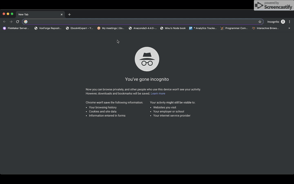

# TOPIC
- Introduction to Data Analysis with Pandas
- This is basic level tutorial, with visualization included

# WHAT TO GET
- Your machine/laptop/desktop/tablet/phablet/notebook that can connect to internet and an html compatible browser 
- Registered and got user id to connect to our lab environment
- Enthusiasm and willingness to jump in 

# STUDENT LAB
  
If you plan to use jupyterlab (the future of jupyter), then follow instructions [here](https://jupyterlab.readthedocs.io/en/stable/getting_started/installation.html). If you installed jupyter on mac using homebrew, even though your jupyter version is > 5.3 (`jupyter notebook --version`), you might have to `jupyter serverextension enable --py jupyterlab --sys-prefix`  

For matplotlib to display plots properly in jupyterlab, install [jupyter-matplotlib](https://github.com/matplotlib/jupyter-matplotlib) and in the notebook use `%matplotlib widget` - This is specifically when you want to create grid of multiple plots and draw many at once (using matplotlib object oriented api) and control their size and drawing area

# COURSE INDEX
- Background, history of Pandas and relationship with ecosystem
- Environment set up, landscape and navigating within notebooks
- Brief History of Pandas
- Basic Exploration
- Select, filter, sort
- Clean, transform 
- Aggregates
- Visualization with matlplotlib, seaborn, bokeh etc. 
- Real time use cases

# TAKE AWAYS
- Feeling that your time was well spent & insightful
- Presentations, class room code and take home exercises
- Cheat Sheets, recorded videos of the class and network with other similar mindsets

# PRESENTATION DECK
[Minimal Deck](https://slides.com/machzqcq/deck-2)

# TRIVIA
How did I make the animated gif ? [here](https://gist.github.com/paulirish/b6cf161009af0708315c)