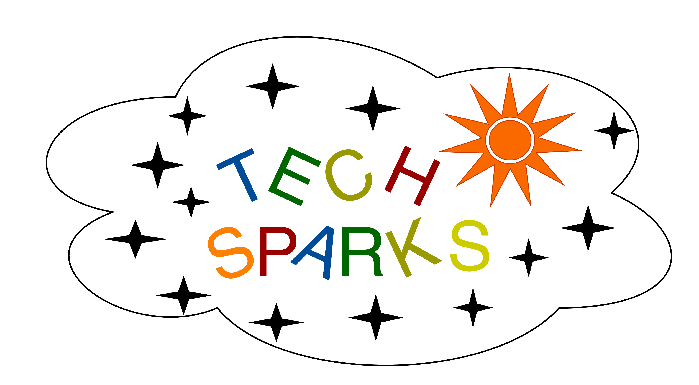

# TOPIC
- Introduction to Data Analysis with Pandas
- This is basic level tutorial (intermediate and advanced will follow)

# WHAT TO GET
- Your laptop that can connect to internet and an html compatible browser 
- Willingness to learn

# STUDENT LAB

# COURSE INDEX
- Background, history of Pandas and relationship with ecosystem
- Environment set up, landscape and navigating within notebooks
- Brief History of Pandas
- Basic Exploration
- Select, filter, sort
- Clean, transform 
- Real time use cases

# TAKE AWAYS
- Feeling that your time was well spent & insightful
- Homework that you committed for when signing up
- Some material that can help you explore deeper, and cheat sheets 

# PRESENTATION DECK
[Minimal Deck](https://slides.com/machzqcq/deck-2)

# TRIVIA
How did I make the animated gif ? [here](https://gist.github.com/paulirish/b6cf161009af0708315c)