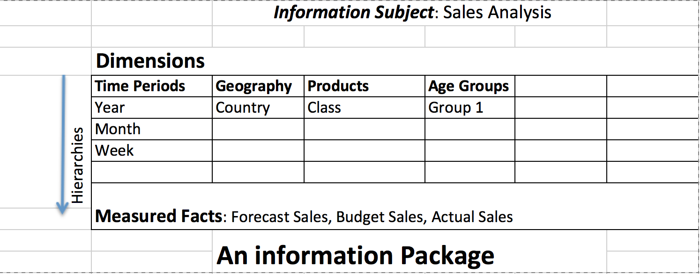

# Datawarehouse 
Concepts below are taken from the book "Datawarehouse fundamentals by Paulraj Ponniah". 
The concepts align with tranditional thinking in datawarehouse analytics around star/cube schemas etc. which was the dominant thinking before more modern systems of Big Data came into existence. That said, the conversations to document warehouse requirements still hold

# Information package
An information package represents a subject area , that matters to the business. It is a way to collect requirements (from business) in terms of what matters for selling.  

| Overall Guidelines                                  |
|-----------------------------------------------------|
| Define the common subject areas                     |
| Design key business metrics                         |
| Decide how data must be presented                   |
| Determine how users will aggregate or roll up       |
| Decide the data quantity for user analysis or query |
| Decide how data will be accessed                    |
| Establish data granularity                          |
| Estimate data warehouse size                        |
| Determine the frequency for data refreshing         |
| Ascertain how information must be packaged          |  

An example would be as below. In the below, we are talking about Sales Analysis  

We can read the above as:

- Forecast sales by year, month, week and so on...
- Forecast sales by Country ...
- Forecast sales by product
- and so on....  

Each dimension can have hierarchies (For e.g. Time period can be Year, month, week, day, holidays etc.)  
- These business dimensions ultimately help in figuring out the data attributes that go into technical dimensions/facts while designing data warehouse.
- The technical dimensions/facts map to tables in database
- ETL jobs (programming) determines how the dimensions/facts get populated and also determine how data moves across technical systems
- It is EXTREMELY crucial to be very clear on the business dimensions from the beginning in terms of connecting "why", "what" and ultimately "how"