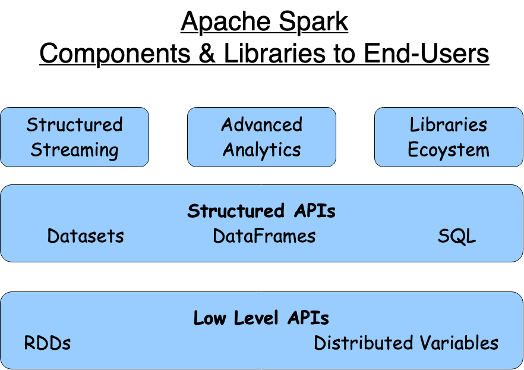
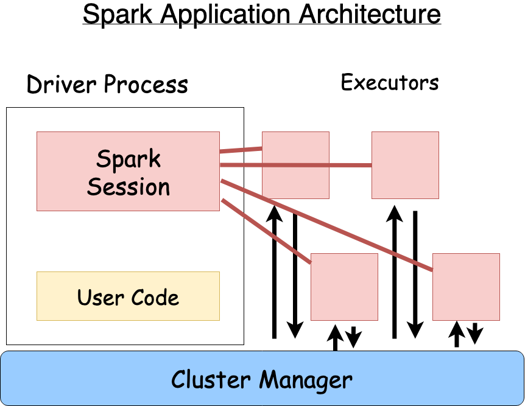

# Apache Spark Features

# General Knowledge

- Spark is written in Scala and executed on JVM
- Spark interactive consoles can be launched via `./bin/pyspark` (and then type `spark` for SparkSession) OR `./bin/spark-shell` for scala OR `./bin/spark-sql` for SQL console

# Spark Application
Spark Applications consist of a driver process and a set of executor processes  

### Driver Process
The driver process runs your main() function, sits on a node in the cluster, and is responsible for three things: maintaining information about the Spark Application; responding to a user’s program or input; and analyzing, distributing, and scheduling work across the executors.

### Executor Process
The executors are responsible for actually carrying out the work that the driver assigns them. This means that each executor is responsible for only two things: executing code assigned to it by the driver, and reporting the state of the computation on that executor back to the driver node

### Local Mode
Spark, in addition to its cluster mode, also has a local mode. The driver and executors are simply processes, which means that they can live on the same machine or different machines. In local mode, the driver and executurs run (as threads) on your individual computer instead of a cluster.