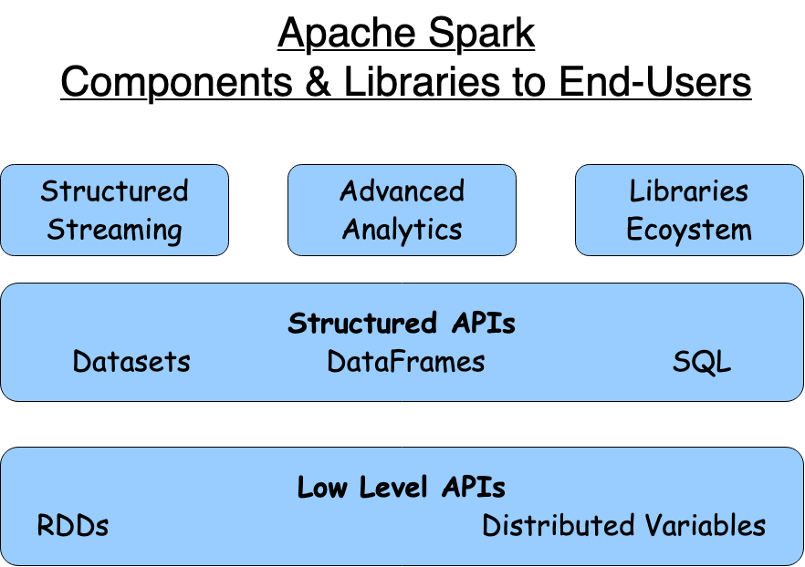
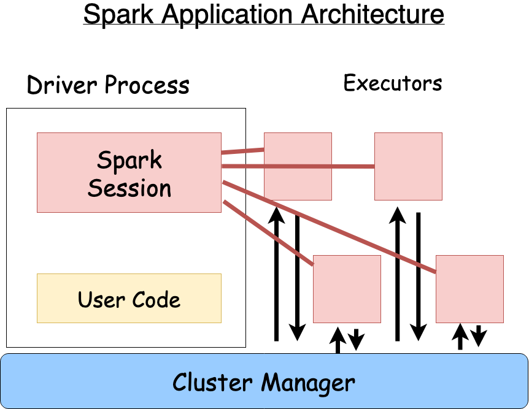

# Apache Spark Features



# General Knowledge

- Spark is written in Scala and executed on JVM
- Spark interactive consoles can be launched via `./bin/pyspark` (and then type `spark` for SparkSession) OR `./bin/spark-shell` for scala OR `./bin/spark-sql` for SQL console

# Spark Application
Spark Applications consist of a driver process and a set of executor processes. There is a one-to-one correspondence between a SparkSession and a Spark Application  



### Driver Process
The driver process runs your main() function, sits on a node in the cluster, and is responsible for three things: maintaining information about the Spark Application; responding to a user’s program or input; and analyzing, distributing, and scheduling work across the executors.

### Executor Process
The executors are responsible for actually carrying out the work that the driver assigns them. This means that each executor is responsible for only two things: executing code assigned to it by the driver, and reporting the state of the computation on that executor back to the driver node

### Local Mode
Spark, in addition to its cluster mode, also has a local mode. The driver and executors are simply processes, which means that they can live on the same machine or different machines. In local mode, the driver and executurs run (as threads) on your individual computer instead of a cluster.

### Interative vs. Standalone
When you start Spark in this interactive mode, you implicitly create a SparkSession that manages the Spark Application. When you start it through a standalone application (spark-submit), you must create the SparkSession object yourself in your application code.


# Spark Partitions
- To allow every executor to perform work in parallel, Spark breaks up the data into chunks called partitions. A partition is a collection of rows that sit on one physical machine in your cluster. A DataFrame’s partitions represent how the data is physically distributed across the cluster of machines during execution. 
- If you have one partition, Spark will have a parallelism of only one, even if you have thousands of executors. 
- If you have many partitions but only one executor, Spark will still have a parallelism of only one because there is only one computation resource
- An important thing to note is that with DataFrames you do not (for the most part) manipulate partitions manually or individually

# Spark UI
- Generally available on port 4040 of driver node

# DataFrames vs. SQL
- You can express your business logic in SQL or DataFrames (either in R, Python, Scala, or Java) and Spark will compile that logic down to an underlying plan (that you can see in the explain plan) before actually executing your code. 
- With Spark SQL, you can register any DataFrame as a table or view (a temporary table) and query it using pure SQL. 
- There is no performance difference between writing SQL queries or writing DataFrame code, they both “compile” to the same underlying plan that we specify in DataFrame code

# SparkSession vs. SparkContext
- You can have one and only one SparkContext on a single JVM, but the number of SparkSessions is pretty much unbounded.
- You can have as many SparkSessions as needed
- SparkSession is a mere wrapper around SparkContext to offer Spark SQL's structured/SQL features on top of Spark Core's RDDs
- You can only have one SparkContext at one time. Although you can start and stop it on demand as many times you want, but I remember an issue about it that said you should not close SparkContext unless you're done with Spark. In other words, have a single SparkContext for the entire lifetime of your Spark application. This is evident when you see Spark UI and start multiple sessions, yet there is only driver
- Many applications built on Spark (e.g. incorta visual tool) are extremely careful to manage the lifecyle of SparkContext object, and mention in their documentation that the application/system owns managing the lifecycle of SparkContext and not available to user

# Gotchas
- If you don't find your spark application displaying in webUI (:8080), check that you started sparkSesssion in cluster mode i.e. set `spark://192.168.0.4:7077` on sparksession and not `local`

# Various ways to start spark master
- Navigate to your Spark installation directory:
### Start the master:
- bin\spark-class org.apache.spark.deploy.master.Master
- Or use the batch file/shell if available:
- sbin\start-master.cmd

### Method 2: Using spark-submit
- bin\spark-submit --class org.apache.spark.deploy.master.Master --master local[*]
### Method 3: Direct Java command
- java -cp "jars\*" org.apache.spark.deploy.master.Master
#### Configuration Options
You can customize the master with these parameters:
- bin\spark-class org.apache.spark.deploy.master.Master --host localhost --port 7077 --webui-port 8080
#### Common options:
```
--host or -h: Hostname to bind to (default: localhost)
--port or -p: Port to bind to (default: 7077)
--webui-port: Web UI port (default: 8080)
--properties-file: Path to properties file
```
