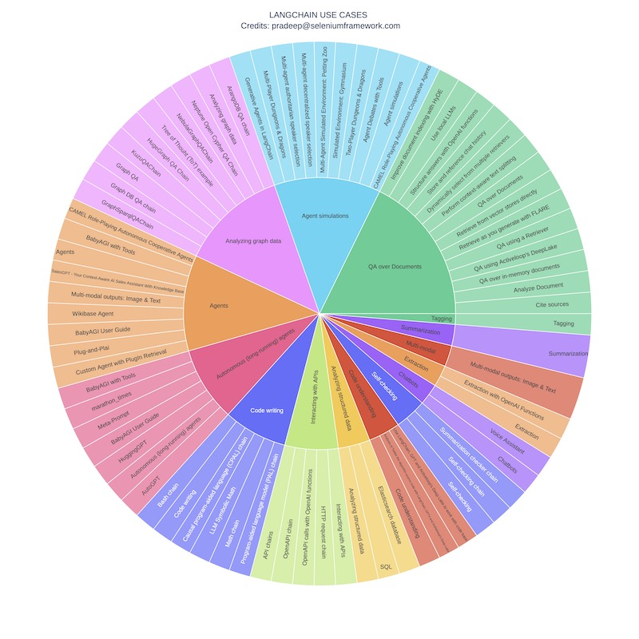
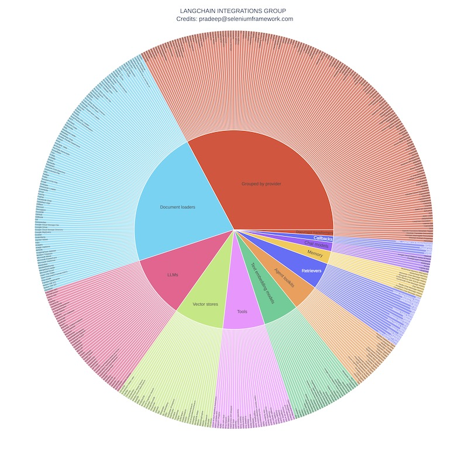

# How to Navigate

   

LangChain is the forerunner in establishing a framework for developing LLMs and Chat applications (as of July 2023). That is why you see many prominent AI gurus have partnered with langchain and new courses are being taught (e.g. deeplearning.ai and databricks - really see their marketing courses and how much of the content is langchain vs. not).  
It is difficult to navigate this whole LLM space after chatGPT made the LLM capabilities viral. If you are someone who is developing / going to develop in this space, you will bound to encounter the below at the top of the chain  
- Langchain (overall abstraction framework for executing the idea in LLM space)
- HuggingFace (hub that hosts all models, data and also a hosting provider. In short I can think of it as a cloud provider when you need to develop anything in the AI/ML space including LLM models)
- Micro app frameworks like streamlit/gradio which can help an LLM developer spin up an application and demo/showcase without having to step into great details of Software Engineering space

Use the below two links (if you want png/jpeg or pdf, keep reading below) for interactive graphs (scroll to bottom)

- [Use Cases](https://static.symmetrics.fyi/blog/langchain/langchain_visualize_hierarchical_usecases.html)
- [Integrations](https://static.symmetrics.fyi/blog/langchain/langchain_visualize_hierarchical_integrations.html)

# Navigate
For Langchain , when someone starts to learn the website has usecases and integrations and docs as main menu items. One can go through all pages one by one and learn (that is the most exhaustive option you can ever have). Of course, you could also go to udemy and 1000 MOOC courses (videos and tutorials etc.), but understand that learning from horse's mouth always gives you the best albeit relatively slow - further tradeoff between quality vs. quantity  

Having a hierarchical map always helps me understand the landscape - either during learning or when helping my clients with zillion choices that one has to make (for e.g. which model to choose, where to host itself has so many choices - just look at langchain integrations page). 

To make it easier, I created two hierarchical maps - sunburst and treemap (both are visual representations, but give you an index of what is out there)

# How did I do it 
Well, basically determined the hierarchy by scraping their website and packing all the information in the visual. To be fair, I do not want to checkin the scraping script - because someone (or bad actors) might start using that and causing DOA attacks on the website. And I don't want that to happen, just because I rely on the documentation and I appreciate the blood/sweat of the langchain team.  

# Static InfoGraphs
Here are the PDFs and images

### Use Cases
- [langchain_usecases_sunburst.pdf](https://static.symmetrics.fyi/blog/langchain/langchain_usecases_sunburst.pdf)
- [langchain_usecases_treemap.pdf](https://static.symmetrics.fyi/blog/langchain/langchain_usecases_treemap.pdf)

- [langchain_usecases_sunburst.jpg](https://static.symmetrics.fyi/blog/langchain/langchain_usecases_sunburst.jpg)
- [langchain_usecases_treemap.jpg](https://static.symmetrics.fyi/blog/langchain/langchain_usecases_treemap.jpg)

### Integration Groups

- [langchain_integrations_group_sunburst.pdf](https://static.symmetrics.fyi/blog/langchain/langchain_integrations_group_sunburst.pdf)
- [langchain_integrations_group_treemap.jpg](https://static.symmetrics.fyi/blog/langchain/langchain_integrations_group_sunburst.jpg)

# Interactive graphs
There are two main hierarchies - use cases and integrations. You can use the below links to view and navigate. You can click on a item in the sunburst and its hierarchy would expand (click again to revert)

- [Use Cases](https://static.symmetrics.fyi/blog/langchain/langchain_visualize_hierarchical_usecases.html)
- [Integrations](https://static.symmetrics.fyi/blog/langchain/langchain_visualize_hierarchical_integrations.html)

# What else can you do ?
- Feel free to use it for competitive analysis if you are in an enterprise setting and need to pick vendors
- If you need help don't hesitate to [reach out](pradeep@seleniumframework.com)